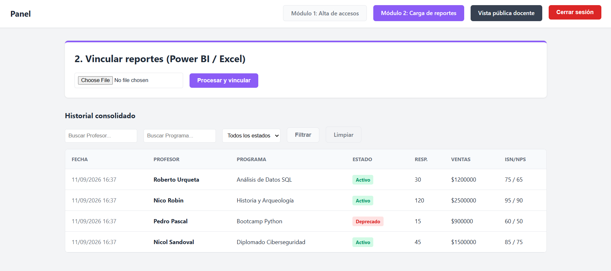

# 📊 Panel ETL & Gestión de Reportes Docentes


Sistema integral desarrollado para la gestión, validación y consolidación de reportes académicos. Este proyecto automatiza procesos ETL (Extracción, Transformación y Carga) desde archivos CSV, protegiendo la integridad de los datos mediante almacenamiento relacional y control de acceso basado en roles (RBAC).

Proyecto académico desarrollado para la carrera de Analista Programador (INACAP).

---

## ✨ Características Principales

* **Módulo ETL Automatizado:** Ingesta de datos vía CSV con validación de tipos (`try/except`) para prevenir errores de servidor (HTTP 500).
* **Control de Acceso (RBAC):** Sistema de seguridad con decoradores personalizados operando en el servidor (backend) para los roles `admin`, `normal` y `viewer`.
* **Dashboard Consolidado:** Interfaz de administración con filtros dinámicos por nombre, programa y estado.
* **Operaciones CRUD & Borrado Lógico:** Gestión completa del ciclo de vida de los datos. La eliminación de registros utiliza *soft delete* para mantener el historial de auditoría intacto.
* **Portal Docente (Read-Only):** Vista pública validada mediante cruce de identidad (Nombre + Token único de acceso).

---

## 📸 Vistas del Sistema

*(Nota: Las siguientes imágenes demuestran el flujo principal de la aplicación)*

### 1. Acceso de Administrador


### 2. Módulo 1: Generación de Tokens


### 3. Módulo 2: Dashboard y Carga de Reportes


### 4. Portal Público Docente


---

## 🛠️ Tecnologías Utilizadas

* **Backend:** Python, Django 5.0
* **Base de Datos:** SQLite (ORM de Django)
* **Frontend:** HTML5 Semántico, CSS3 (Variables, Flexbox), Responsive Design
* **Seguridad:** Tokens CSRF, variables de entorno (`python-decouple`), autenticación nativa de Django.

---

## 🚀 Instalación y Despliegue Local

1. **Clonar el repositorio:**
   ```bash
   git clone [https://github.com/tu-usuario/tu-repositorio.git](https://github.com/tu-usuario/tu-repositorio.git)
   cd tu-repositorio
   ```

## Crear y activar el entorno virtual:
```bash
python -m venv env
# En Windows:
env\Scripts\activate
```
## Instalar dependencias:
```bash
pip install -r requirements.txt

```
## Configurar variables de entorno:

* Copia el archivo .env.example y renómbralo a .env.

* Asigna una clave secreta a la variable SECRET_KEY.

## Aplicar migraciones y ejecutar el servidor:

```bash
Bash
python manage.py migrate
python manage.py runserver
```

Autor: Nicol Sandoval Urqueta