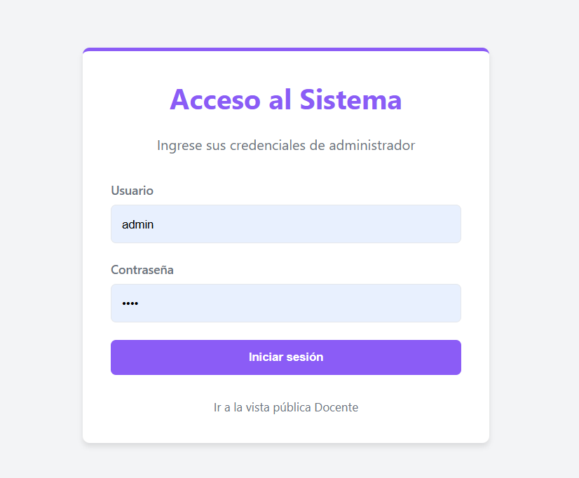
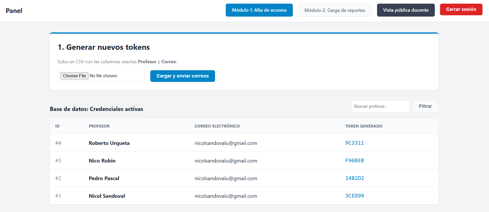
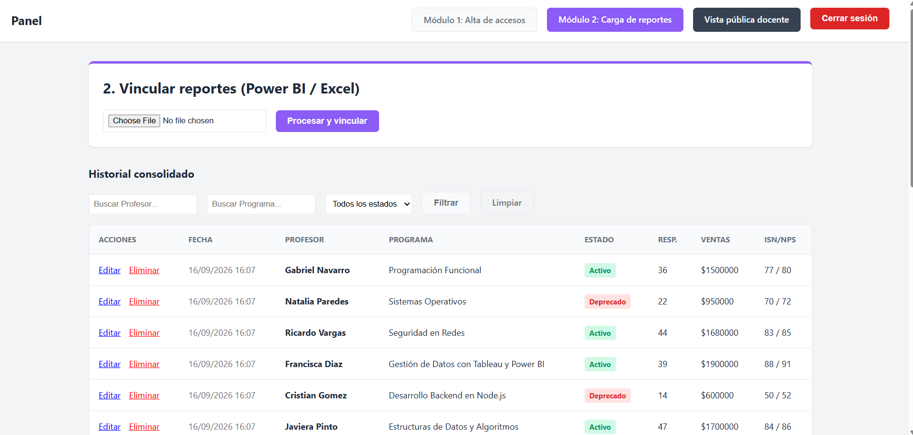
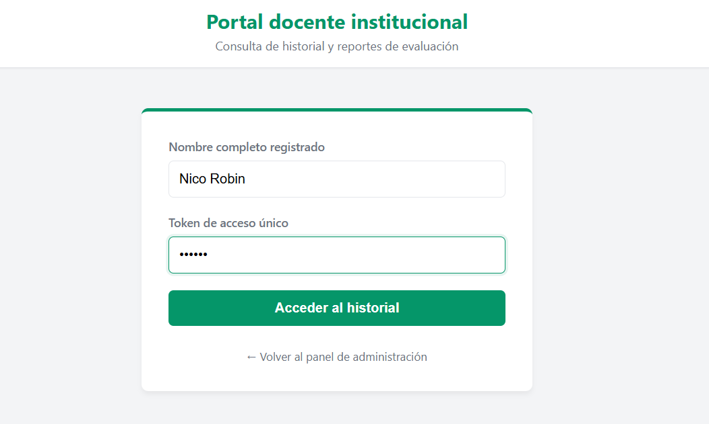
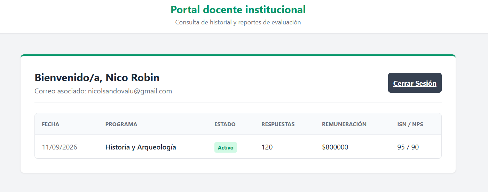

# 📊 Panel ETL & Gestión de Reportes Docentes


Sistema integral desarrollado para la gestión, validación y consolidación de informes académicos. Este proyecto automatiza procesos ETL (Extracción, Transformación y Carga) desde archivos CSV, protegiendo la integridad de los datos mediante almacenamiento relacional y control de acceso basado en roles (RBAC).

Proyecto académico desarrollado para la carrera de Analista Programador (INACAP).

---

## ✨ Características principales
* **Módulo ETL automatizado:** Ingesta de datos vía CSV con validación de tipos (`try/except`) para prevenir errores de servidor (HTTP 500).
* **Control de acceso (RBAC):** Sistema de seguridad con decoradores personalizados operando en el servidor (backend) para validar los grupos de usuarios.
* **Dashboard consolidado:** Interfaz de administración con filtros dinámicos por nombre, programa y estado.
* **Operaciones CRUD y borrado lógico:** Gestión completa del ciclo de vida de los datos. La eliminación de registros utiliza borrado lógico (`soft delete`) para mantener intacto el historial de auditoría.
* **Portal docente (solo lectura):** Vista pública validada mediante cruce de identidad (Nombre + Token único de acceso criptográfico).

---

## 📸 Vistas del sistema

*(Nota: Las siguientes imágenes demuestran el flujo principal de la aplicación)*

### 1. Acceso de administrador


### 2. Módulo 1: Generación de tokens


### 3. Módulo 2: Dashboard y carga de reportes


### 4. Portal docente


---

## 🛠️ Tecnologías utilizadas

* **Backend:** Python, Django 5.0
* **Base de Datos:** SQLite (ORM de Django)
* **Frontend:** HTML5 Semántico, CSS3 (Variables, Flexbox), Responsive Design
* **Seguridad:** Tokens CSRF, variables de entorno (`python-decouple`), autenticación nativa de Django.

---

## 🚀 Instalación y despliegue local

1. **Clonar el repositorio:**
   ```bash
   git clone [https://github.com/nicolsandovalu/sistema-validacion-reportes](https://github.com/nicolsandovalu/sistema-validacion-reportes)
   cd tu-repositorio
   ```

## Crear y activar el entorno virtual:
```bash
python -m venv env
# En Windows:
env\Scripts\activate
```
## Instalar dependencias:
```bash
pip install -r requirements.txt

```
## Configurar variables de entorno:

* Copia el archivo .env.example y renómbralo a .env.

* Asigna una clave secreta a la variable SECRET_KEY.

### Configuración inicial de usuarios y roles
Para probar las vistas protegidas, es necesario crear un superusuario y configurar los roles:
1. Genera el administrador ejecutando: `python manage.py createsuperuser`
2. Inicia el servidor y entra a `http://127.0.0.1:8000/admin/`.
3. Asigna tu usuario de prueba al grupo correspondiente para que los decoradores de rol (`@requiere_rol`) permitan el acceso.

## Aplicar migraciones y ejecutar el servidor:

```bash
Bash
python manage.py migrate
python manage.py runserver
```

Autor: Nicol Sandoval Urqueta